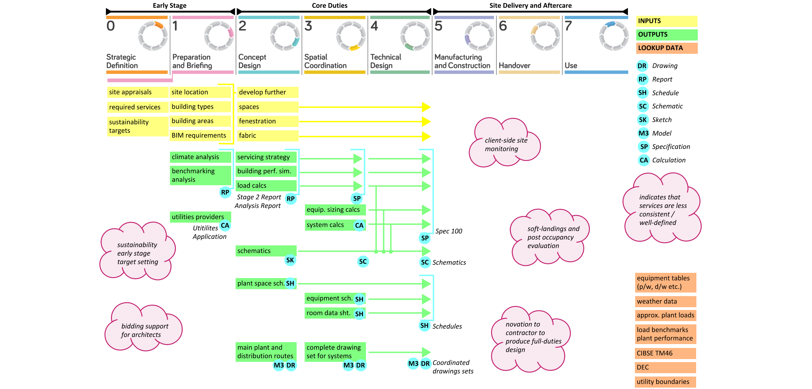
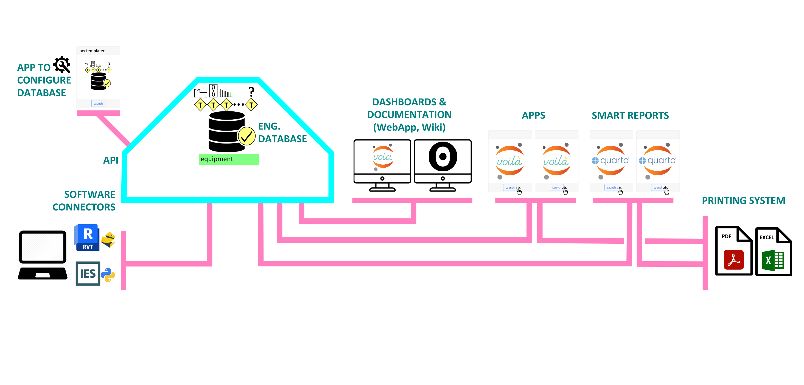
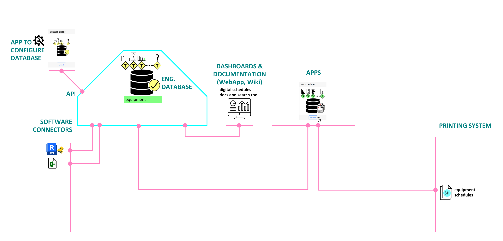
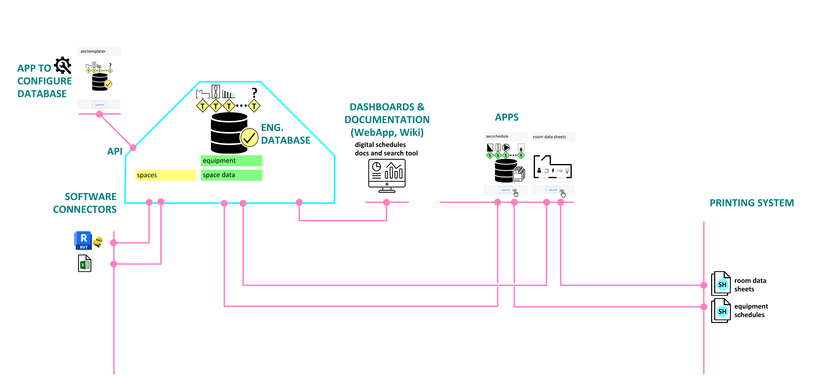
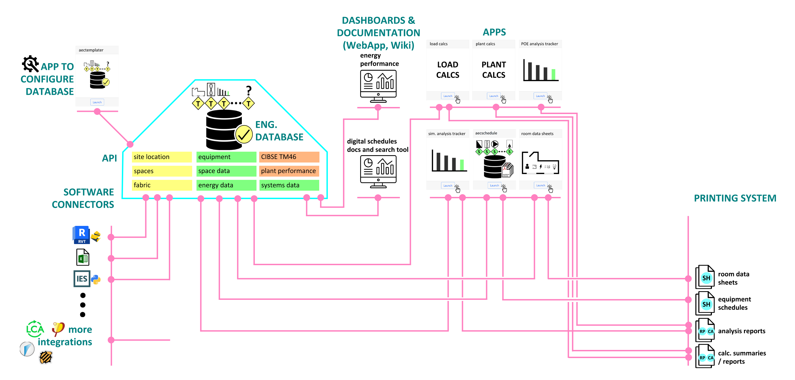
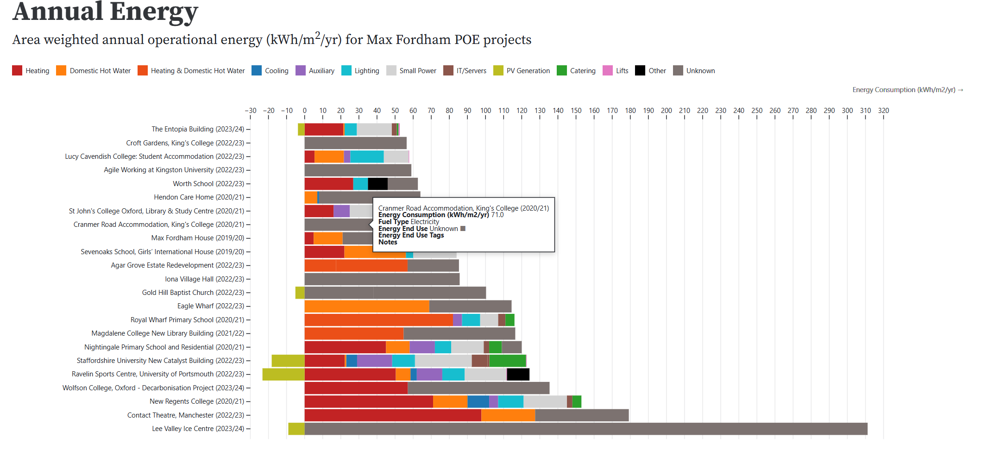
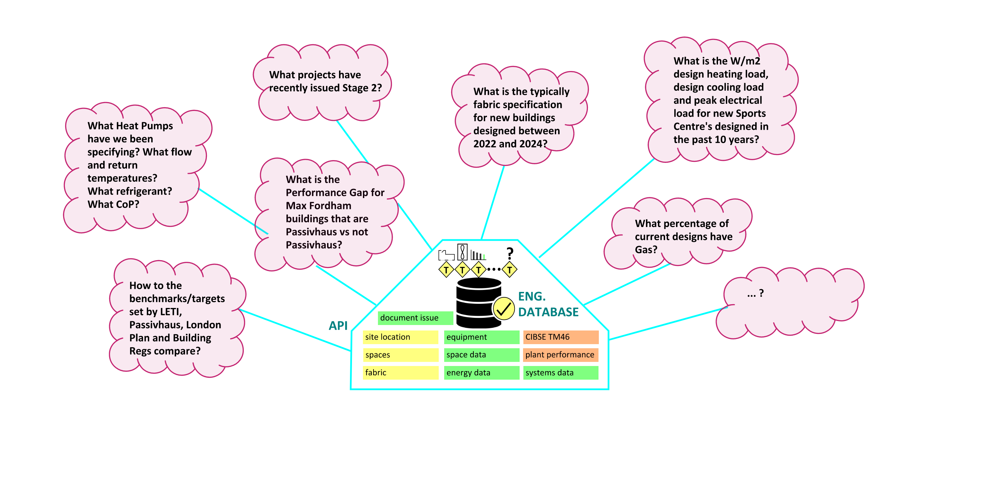
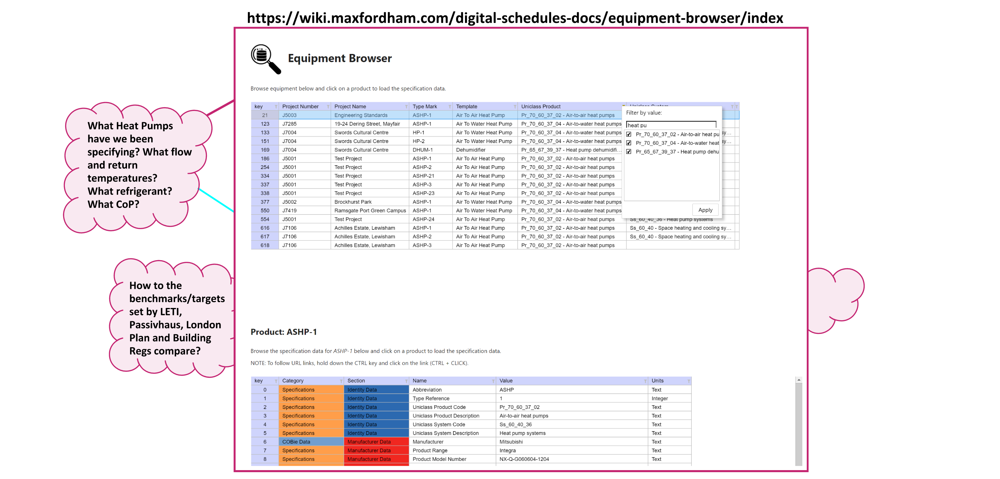
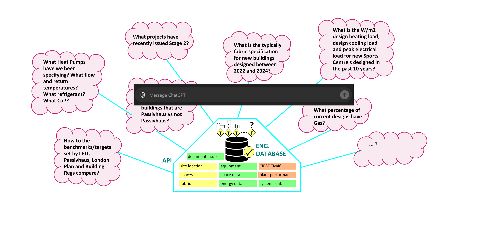

<!--
## Guiding Principles - Tool Development

- In briefing:
  - Tools should have a clear Client stakeholder
  - Should satisfy a clear business need
- In operation, should facilitate: 
  1. Arriving at the correct solution
  2. Clearly / robustly communicating solution
  3. Appraising (1.) and updating (2.) on change of Design 
-->

## Background Info

## Overview of Information supporting Core Service

## Digital Infrastructure - Tech Stack

## Digital Schedules - Equipment

## Digital Schedules - Equipment - Links

- [aecschedule app on toolbox](https://toolbox.maxfordham.com)
  - for saving project data to templates
- [documentation on the Wiki](https://wiki.maxfordham.com/digital-schedules-docs/aecschedule/)
  - [live dashboard of adoption](https://wiki.maxfordham.com/digital-schedules-docs/digital-schedules-adoption/)
  - [equipment browser](https://wiki.maxfordham.com/digital-schedules-docs/equipment-browser/)
  - [templates and properties](https://aectemplater.maxfordham.com)

## Digital Schedules - Room Data Sheets

## Digital Infrastructure - More Apps

## Digital Infrastructure - POE App

- [POE app on toolbox](https://toolbox.maxfordham.com)
- [live dashboard on Wiki](https://wiki.maxfordham.com/Main/POEAnnualEnergy) (planning to migrate it to WebApp instead)

## Digital Infrastructure - Growing Structured Data

## Digital Infrastructure - Engineering Insight / Dashboards

## Digital Infrastructure - Engineering AI

## Monitor Realtime Engineering Data

- **Dont try and capture data on the side!**
- Apps that collate / operate on structured data have monitoring built-in
- The collected data drives insight, review and lessons learnt
- Our designs should contain all the data we need! Use it! 

## Data added by apps will be integrated into the WebApp

## WIP Demo