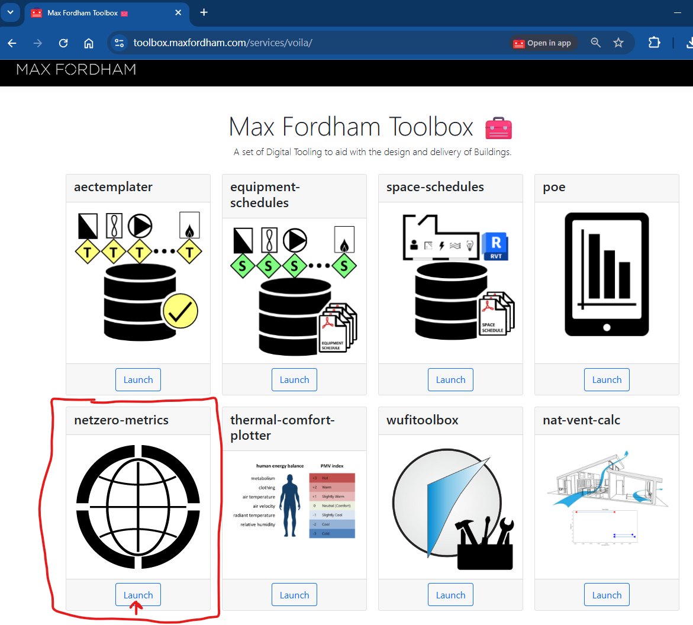
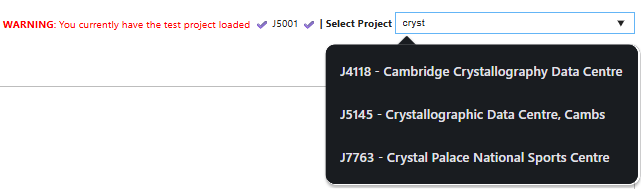
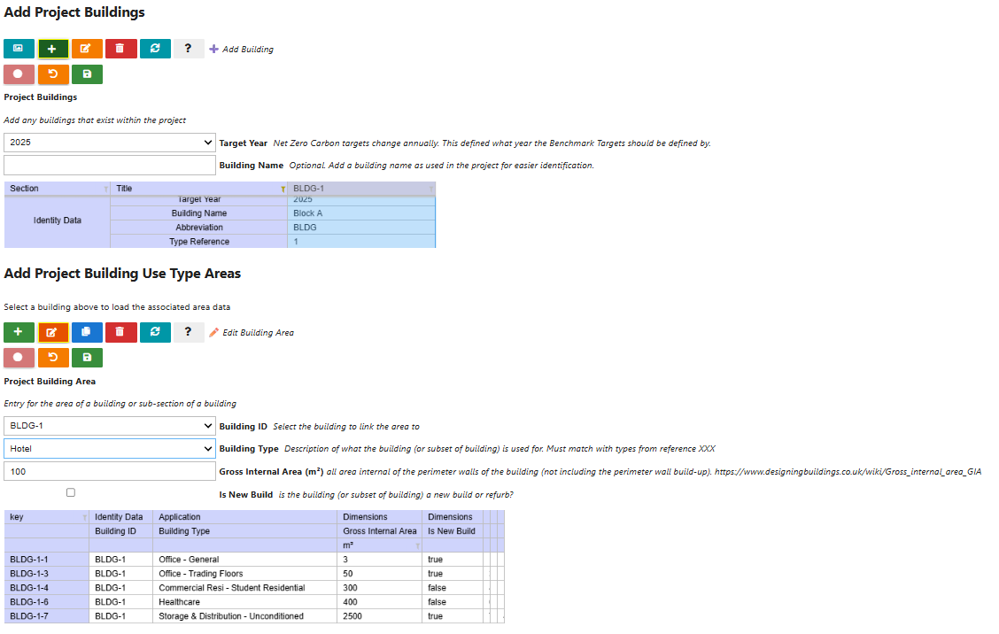
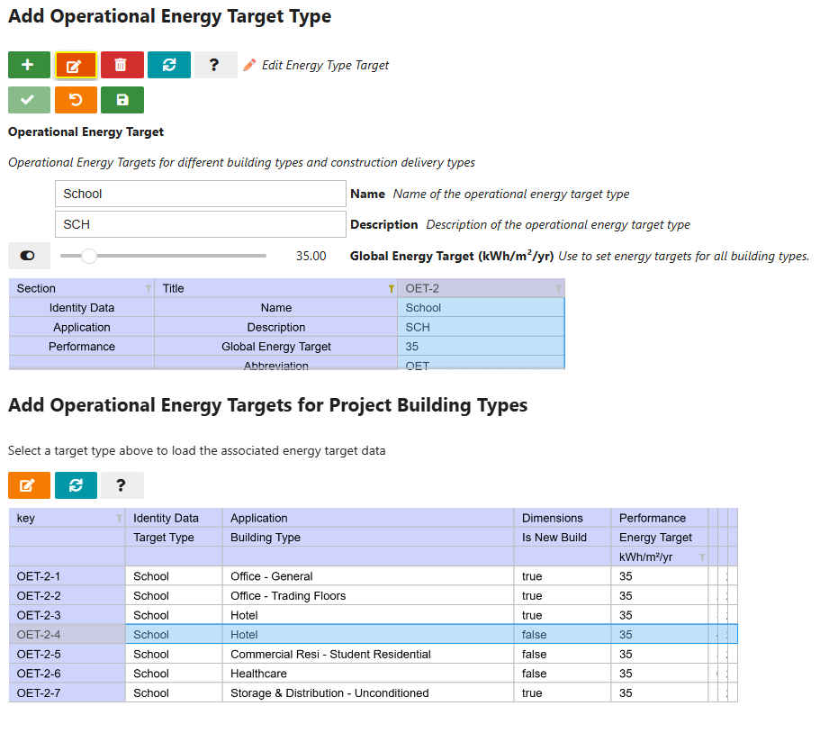
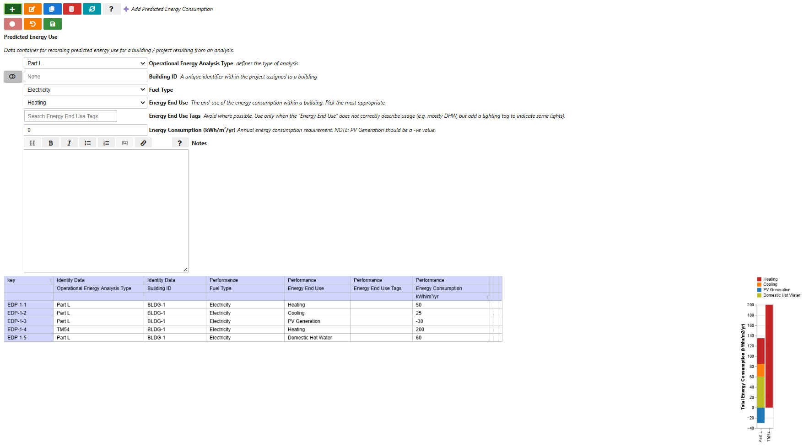
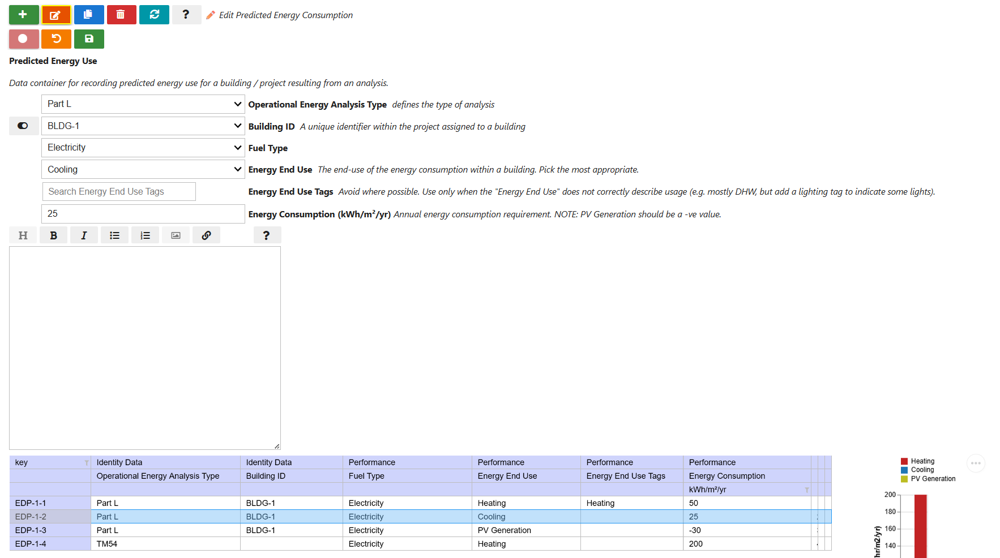

::: {.callout-warning}
You must be connected to the Max Fordham internal engineering  to use the `netzero-metrics` app.
:::

The `netzero-metrics` app allows the Practice and a Project to track the buildings performance compared to the Net Zero Carbon Buildings Standard.
Each tab in the app represents an opportunity to add data and recieve metrics.
The information input into the app is summarised in the Project Summary page that the app launches on.

## Launch `netzero-metrics` App

## Select your Project

## Add Project Buildings and Use Type Areas

This is the main input for the calculation of the UKNZCBs target.
By inputting how much area is assigned to what type of architectual / functional end-use, the app can perform an area weighted target calculation for your project and give a project Target Operational Energy. 

{.lightbox}

## Add Custom Project Targets (if required)

The UKNZCB standard recommends targets based on the building types and areas in the project.
On review of the project and client aspirations the project team may wish recommending a slightly different target.
This tab allows Engineers / Consultants to suggest different project targets.
These is plotted next to UKNZCB target to ensure that context is included.

Use "Global Energy Target" if you wish to apply the same target to all Building Types in the project,
or set custom targets for each building type.

{.lightbox}

## Predicted Operational Energy

Add the predicted operational energy use for your project.
Entries may be granular, rows will automatically be summed and presented by "Energy End Use" for a given "Operational Energy Analysis Type".

## In-Use Operational Energy

Complete the data in the same way as the "Predicted Operational Energy" tab but it summarises the data by "Reporting Period" rather than "Operational Energy Analysis Type".
To reiterate, if you are collecting the data from many sources you can input the raw data with as many
rows as you like and it will automatically sum rows with the same "Energy End Use" and "Reporting Period".

"Energy End Use Tags" should be generally ignored but exists in case you need to document secondary "Energy End Use" loads.

{.lightbox}

